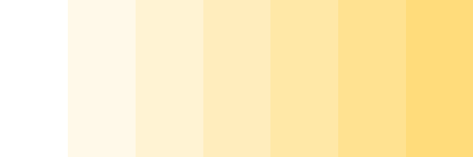
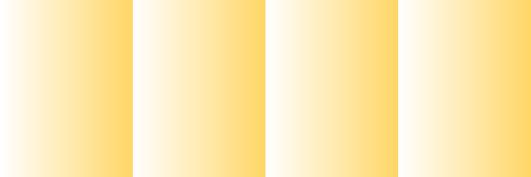
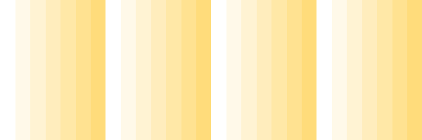
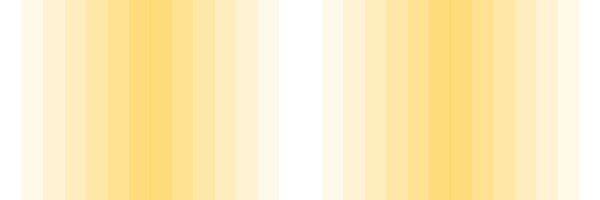
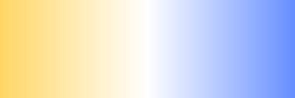
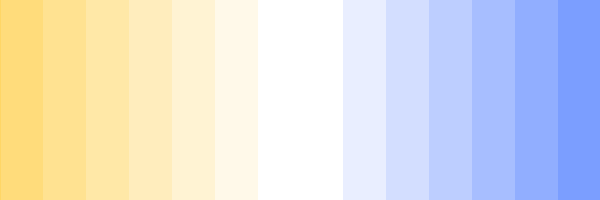

# theory
* [Pastel color](https://en.wikipedia.org/wiki/Pastel_(color))
* [color gradient](https://en.wikipedia.org/wiki/Color_gradient) 


# Examples

Gradient types:
* General types
  * continous  
  * discrete  
* Joining types ( see also in [1D RGB gradient](https://github.com/adammaj1/1D-RGB-color-gradient/blob/main/README.md#continous-gradient-manipulations))
  * no  
  * steps  
  * tubes  
  * diverging  


## HSV = [0.123, s, 1.0]













0.123000_continous_diverging  






# Name
* tints (a mixture of a base color with white )
* pale colors = increased lightness
* pastel colors
* soft or muted type of color
* light color


# Effect
* soothing to the eye
* looks less intense, pastel, pale, faded look.
* subtle, modern or sophisticated design


# Algorithm

General description
* mix base color with white = heavily tinted with white = desaturated with white
* [first generate a random color. Then we sature it a little and mix this color with white color](https://mdigi.tools/random-pastel-color/ random-pastel-color by Micro Digital Tools)
* in HSV. Take a hue. Desaturate the color a bit( = 80% saturation). Use 100% for value. 
* in the HSV color space, have high value and low saturation

## Steps
* choose hue h from full range = [0.0, 1.0]
* set high value  v = 1.0
* change saturation in from 0.0 to 0.6 ( only low to intermediate saturation = limited range )
* convert (h,s,v) to (r,g,b)


```c

/*

Lerp
The method named " Lerp " stands for " Linear_intERPolation" 

OldRange = (OldMax - OldMin)  
NewRange = (NewMax - NewMin)  
NewValue = (((OldValue - OldMin) * NewRange) / OldRange) + NewMin

*/

double pale(double OldValue){

	double OldMax = 1.0; // high value
	double OldMin = 0.0; // low value 
	double OldRange = (OldMax - OldMin);  
	double NewMax = 0.6; // intermediate value
	double NewMin = 0.0; // low value
	double NewRange = (NewMax - NewMin);  
	double NewValue = (((OldValue - OldMin) * NewRange) / OldRange) + NewMin;
	return NewValue;

}

```


```c
/* 
   remember to update : 
   *  add new title in titles array
   * titles in plot.gp
*/

int GivePale_HSV_Color( const double h,  const double s, hsv* hsv_color){

	// input position is double number in range [0,1] = normalized
			 
	/* Pastels or pastel colors belong to a pale family of colors, in the HSV color space, have high value and low to intermediate saturation. */
		
	hsv_color->h = h; // h has the full range
	hsv_color->s = pale(s); /* only low to intermediate saturation: limited range = [0.0, 0.6] */
	hsv_color->v = 1.0; /* constant high value */
  		
  
	
	return 0;
}
```


# Similar projects
* [1D RGB color gradient](https://github.com/adammaj1/1D-RGB-color-gradient)
* [1D HSLUV color gradient : discrete and continous perceptually uniform ordered color gradients rendered in HSL) ](https://github.com/adammaj1/hsluv-color-gradient)


# git

## init
```git
echo "# 1D-pastel-color-gradient-HSV" >> README.md
git init
git add README.md
git commit -m "first commit"
git branch -M main
git remote add origin git@github.com:adammaj1/1D-pastel-color-gradient-HSV.git
git push -u origin main# 1D-pastel-color-gradient-HSV
```


## Subdirectory
```git
mkdir images
git add *.png
git mv  *.png ./images
git commit -m "move"
git push -u origin main
then link the images:
```

   

to overwrite: 

  git mv -f 


